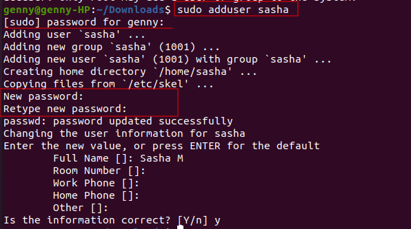

# Matomo-Web-Analytics

## Deploy Matomo Web Analytics on cloud

### What is Matomo?

Matomo is the leading free, open-source analytics platform developed by a team of international developers, that runs on a PHP/MySQL webserver. This platform tracks online visits to one or more websites and displays reports on these visits for analysis. 

This project requires to install Matomo and a MariaDB database using Docker Compose, then install Nginx to act as a reverse proxy for the Matomo app. Finally, enable secure HTTPS connections by using Certbot to download and configure SSL certificates from the Let’s Encrypt Certificate Authority.

In order to successful complete this project, it is important to follow these instructions below:

### 1.  An Ubuntu 20.04 server, with the UFW firewall enabled.

Create a new Ubuntu 20.04 server, and perform some important configuration steps as part of the initial setup. These steps will increase the security and usability of the server, and will give a solid foundation for subsequent actions.

#### Step 1 — Logging in as root

To log into the server, a public IP address for the server is needed.  For security: a password or – configuration of an SSH key authentication – the private key for the root user’s account is important. 

If not already connected to the server, log in now as the root user using the following command (substitute the highlighted portion of the command with the server’s public IP address):

~~~
$ ssh root@your_server_ip

~~~

Accept the warning about host authenticity if it appears. If using password authentication, provide the root password to log in. If using an SSH key that is passphrase protected, may be prompted to enter the passphrase the first time using the key each session. If this is the first time logging into the server with a password, may also be prompted to change the root password. 

The root user is the administrative user in a Linux environment that has very broad privileges. The root account is able to make very destructive changes, even by accident.

#### Step 2 — Creating a New User

Once logged in as root, a new user account can be add.  In the future, we’ll log in with this new account instead of root.

~~~
# adduser sammy

~~~

Answer few questions, starting with the account password.

Enter a strong password and, optionally, fill in any of the additional information if you would like. This is not required and you can just hit `ENTER` in any field you wish to skip.

