# Matomo-Web-Analytics

## Deploy Matomo Web Analytics on cloud


### What is Matomo?

Matomo is the leading free, open-source analytics platform developed by a team of international developers, that runs on a PHP/MySQL webserver. This platform tracks online visits to one or more websites and displays reports on these visits for analysis. 

This project requires to install Matomo and a MariaDB database using Docker Compose, then install Nginx to act as a reverse proxy for the Matomo app. Finally, enable secure HTTPS connections by using Certbot to download and configure SSL certificates from the Let’s Encrypt Certificate Authority.

In order to successful complete this project, it is important to follow these instructions below:

### 1.  An Ubuntu 20.04 server, with the UFW firewall enabled.

Create a new Ubuntu 20.04 server, and perform some important configuration steps as part of the initial setup. These steps will increase the security and usability of the server, and will give a solid foundation for subsequent actions.

##### Step 1 — Logging in as root

For security purposes, log in as root can be done several ways: a password or – configuration of an SSH key authentication – the private key for the root user’s account is important. 

I inially connect to my EC2 server using the following:

 


##### Step 2 — Creating a New User

In order to create a new user, it is important to log in as root. The root user is the administrative user in a Linux environment that has very broad privileges. Type the following command:

~~~
# adduser sammy
~~~


A few questions will be asking, starting with the account password. Enter a strong password, the additional information is not required, just hit `ENTER` to skip.


##### Step 3 — Granting Administrative Privileges

As the new user account is now created, let's add some privileges to it. These privileges will be needed to perform administratives tasks. The process to grant privileges is to add the user to the sudo group. By default, on Ubuntu 20.04, users who are members of the sudo group are allowed to use the sudo command.

~~~
usermod -aG sudo sammy
~~~


##### Step 4 — Setting Up a Basic Firewall

Ubuntu 20.04 servers can use the UFW firewall to make sure only connections to certain services are allowed. Let's set up a basic firewall using this application.

OpenSSH, the service allowing us to connect to our server now, has a profile registered with UFW,

```
# ufw app list
```

Ensure that the firewall allows SSH connections so that we can log back in next time. Allow these connections by typing: 

```
# ufw allow OpenSSH
```

Enable the firewall by typing:

```
# ufw enable
```
Type `yes` and press `ENTER` to proceed. 


```
# ufw status
```


##### Step 5 — Enabling External Access for Your Regular User

Now that we have a regular user for daily use, we need to make sure we can SSH into the account directly


Accessing that new user, there might be some permission issue. To fix that, type:

```
sudo nano /etc/ssh/sshd_config
```
Enter the password for the new user. Then it will open a nano text template as such:


Scroll down and look for :
```
#PermitRootLogin yes
``` 

```
PasswordAuthentication yes
```

change the `no` that already assigned to `yes`
then: 
```
sudo service ssh restart
```


#### How to Set Up SSH Keys on your PC

##### Step 1 — Creating the Key Pair

```
$ ssh-keygen
```


#### Copying the Public Key Using ```ssh-copy-id```

The `ssh-copy-id` tool is included by default in many operating systems, so you may have it available on your local system. For this method to work, you must already have password-based SSH access to your server.

The syntax is:

```
$ ssh-copy-id username@remote_host
```


#### Step 3 - Authenticating to Your Ubuntu Server Using SSH Keys

The basic process is the same:

```
$ ssh username@remote_host
```
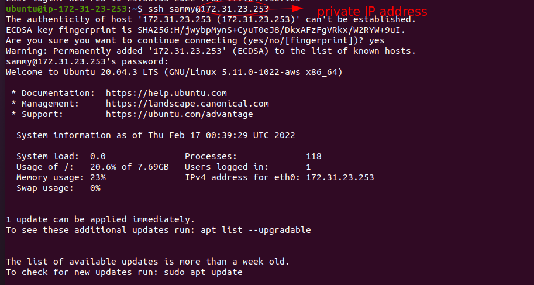

#### Step 4 - Disabling Password Authentication on Your Server

Before completing the steps in this section, make sure that you either have SSH-key-based authentication configured for the root account on this server, or preferably, that you have SSH-key-based authentication configured for a non-root account on this server with sudo privileges.

```
$ sudo nano /etc/ssh/sshd_config
```
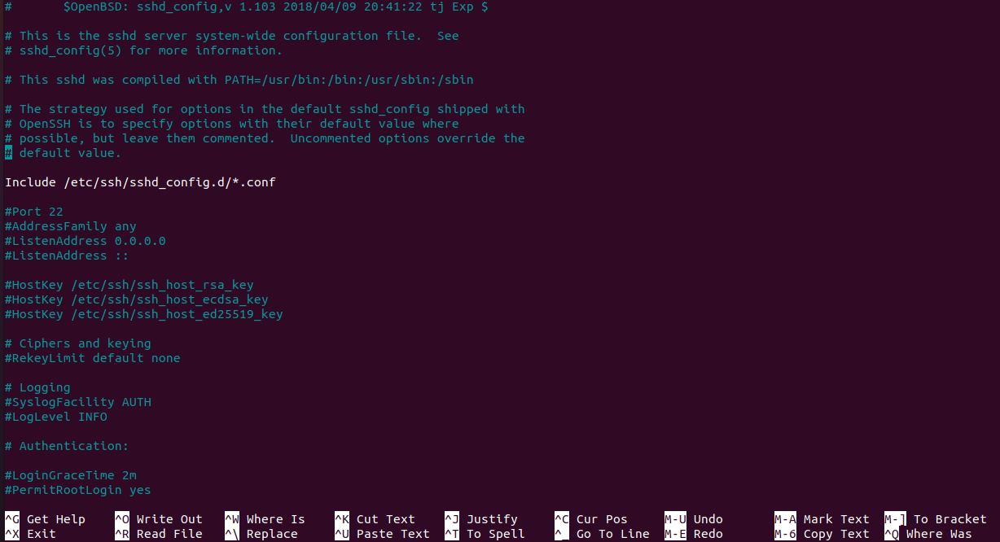

Inside the file, search for a directive called `PasswordAuthentication`. This will disable the ability to log in via SSH using account passwords:

```
. . .
PasswordAuthentication no
. . .
```


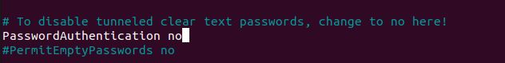

Save and close the file when you are finished by pressing `CTRL+X`, then `Y` to confirm saving the file, and finally `ENTER` to exit nano. To actually activate these changes, restart the `sshd` service:

```
$ sudo systemctl restart ssh
```

Open up a new terminal window and test that the SSH service is functioning correctly before closing the current session:

```
$ ssh username@remote_host
```
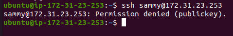


### 2. Docker installed. 

**Docker** is an application that simplifies the process of managing application processes in **containers** . They’re similar to virtual machines, but containers are more portable, more resource-friendly, and more dependent on the host operating system.

#### Prerequisites

To follow this tutorial, you will need the following:

- One Ubuntu 20.04 server set up  including a sudo non-root user and a firewall.
- An account on [Docker Hub](https://hub.docker.com/) if you wish to create your own images and push them to Docker Hub.

#### Step 1 — Installing Docker

The Docker installation package available in the official Ubuntu repository may not be the latest version. To ensure we get the latest version, we’ll install Docker from the official Docker repository. 

First, update your existing list of packages:

```
$ sudo apt update
```
If an error occurs, please type the following command:

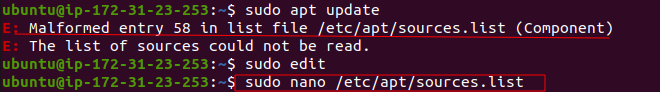

```
sudo nano /etc/apt/sources.list
```

This command will lead to a nano script, then place a space between `focalstable` as indicated below:

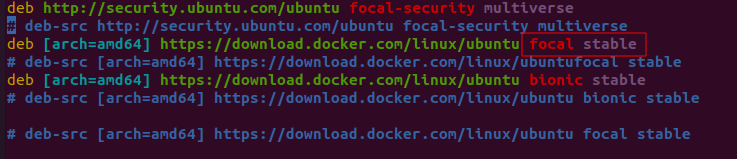

Type this command again:

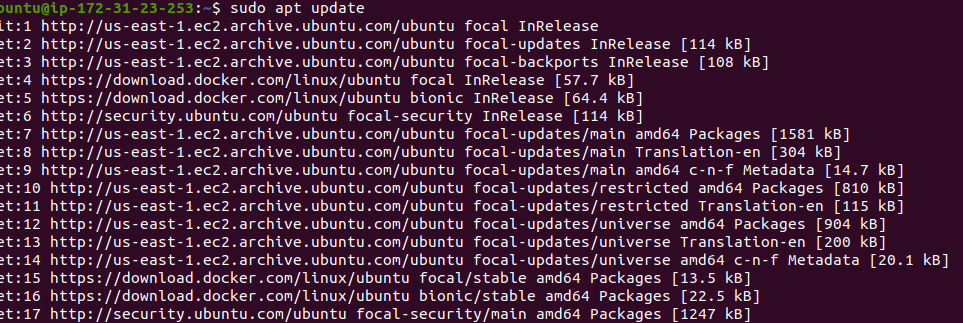


Next, install a few prerequisite packages which let apt use packages over HTTPS:

```
sudo apt install apt-transport-https ca-certificates curl software-properties-common
```
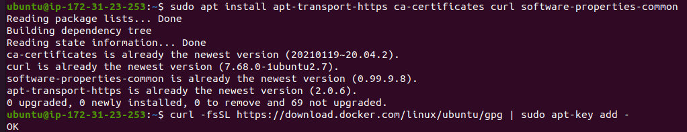

Then add the GPG key for the official Docker repository to the system:

```
$ curl -fsSL https://download.docker.com/linux/ubuntu/gpg | sudo apt-key add -
```

and Add the Docker repository to APT sources:

```
$ sudo add-apt-repository "deb [arch=amd64] https://download.docker.com/linux/ubuntu focal table"

```

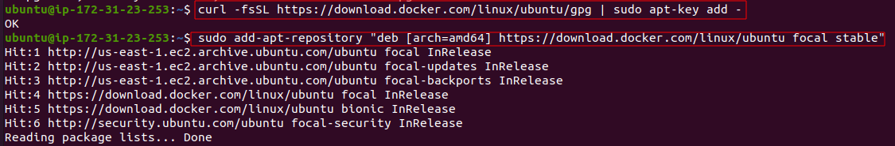

It is important to install from the Docker repo instead of the default Ubuntu repo:

```
apt-cache policy docker-ce
```

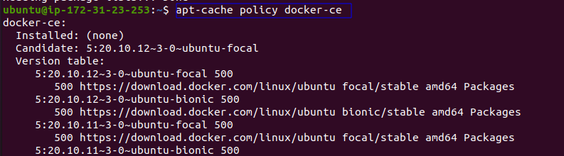


Now, let's install Docker.

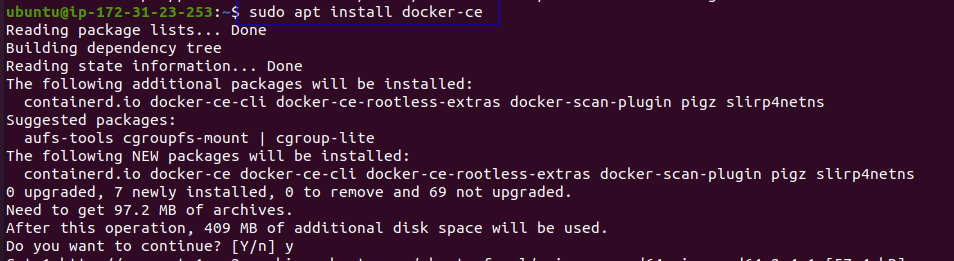


Docker should now be installed, the daemon started, and the process enabled to start on boot. Check that it’s running:

```
$ sudo systemctl status docker
```

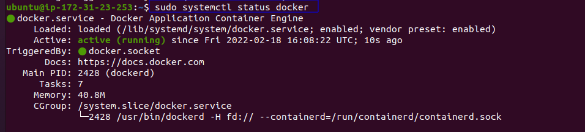


#### Step 2 — Executing the Docker Command Without Sudo (Optional)


By default, the `docker` command can only be run the **root** user or by a user in the **docker** group, which is automatically created during Docker’s installation process. To avoid typing sudo whenever you run the docker command, add your username to the docker group:

first run :

```
$ sudo username
```
then 

```
$ sudo usermod -aG docker ${USER}
```
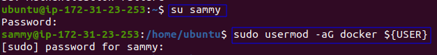

To apply the new group membership, log out of the server and back in, or type the following:

```
$ su - ${USER}
```

It will be prompted to enter the user’s password to continue.
Confirm that your user is now added to the **docker** group by typing:

```
$ groups
```

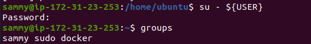

If need to add a user to the docker group that you’re not logged in as, declare that username explicitly using:

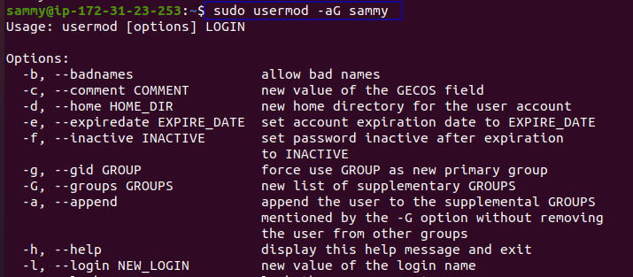


#### Step 3 — Using the Docker Command

To view all available subcommands on docker, type:

```
$ docker
```


#### Step 4 — Working with Docker Images

Docker containers are built from Docker images. By default, Docker pulls these images from Docker Hub, a Docker registry managed by Docker, the company behind the Docker project. 

To check whether you can access and download images from Docker Hub, type:

```
$ docker run hello-world
```
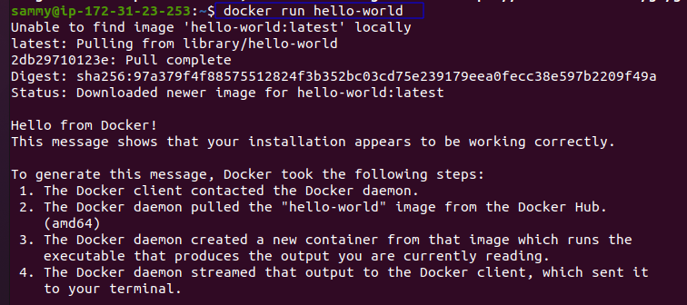

Search for images available on Docker Hub by using the docker command with the search subcommand. Type: 

```
$ docker search ubuntu
```

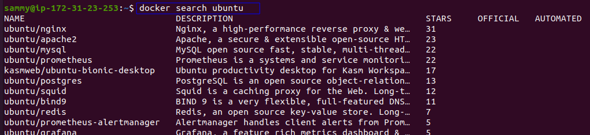

Execute the following command to download the official `ubuntu` image to your computer:

```
$ docker pull ubuntu
```

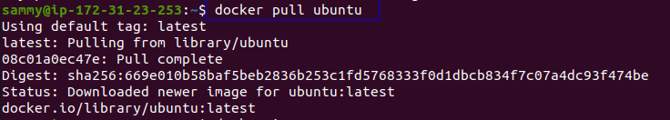

To see the images that have been downloaded to your computer, type:

```
$ docker images
```

#### Step 5 — Running a Docker Container

The hello-world container ran in the previous step is an example of a container that runs and exits after emitting a test message. Containers can be much more useful than that, and they can be interactive. Containers are similar to virtual machines, but more resource-friendly.

