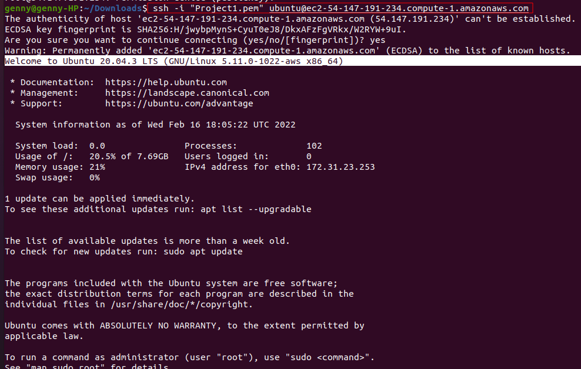
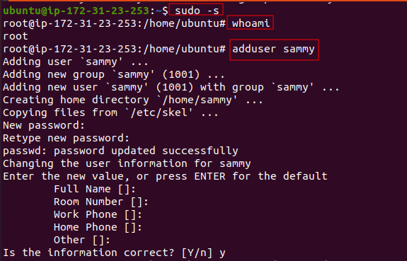
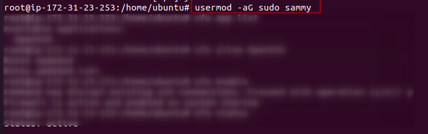
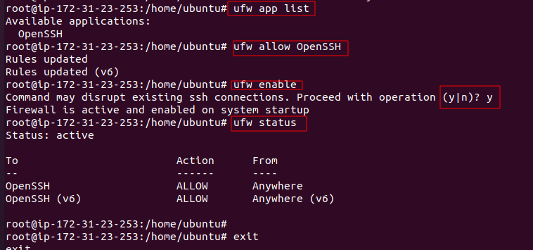
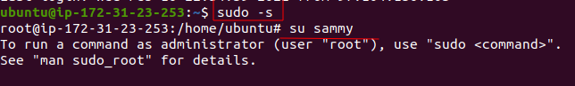
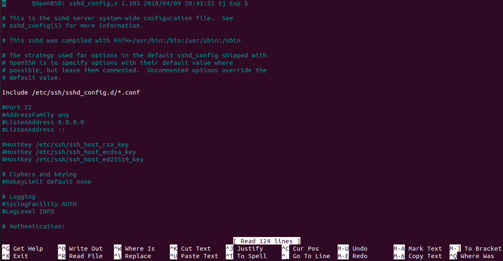
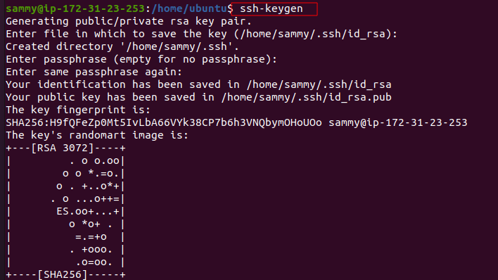
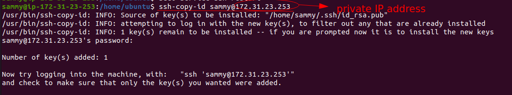

# Matomo-Web-Analytics

## Deploy Matomo Web Analytics on cloud


### What is Matomo?

Matomo is the leading free, open-source analytics platform developed by a team of international developers, that runs on a PHP/MySQL webserver. This platform tracks online visits to one or more websites and displays reports on these visits for analysis. 

This project requires to install Matomo and a MariaDB database using Docker Compose, then install Nginx to act as a reverse proxy for the Matomo app. Finally, enable secure HTTPS connections by using Certbot to download and configure SSL certificates from the Let’s Encrypt Certificate Authority.

In order to successful complete this project, it is important to follow these instructions below:

### 1.  An Ubuntu 20.04 server, with the UFW firewall enabled.

Create a new Ubuntu 20.04 server, and perform some important configuration steps as part of the initial setup. These steps will increase the security and usability of the server, and will give a solid foundation for subsequent actions.

#### Step 1 — Logging in as root

For security purposes, log in as root can be done several ways: a password or – configuration of an SSH key authentication – the private key for the root user’s account is important. 

I inially connect to my EC2 server using the following:

 


#### Step 2 — Creating a New User

In order to create a new user, it is important to log in as root. The root user is the administrative user in a Linux environment that has very broad privileges. Type the following command:

~~~
# adduser sammy
~~~



A few questions will be asking, starting with the account password. Enter a strong password, the additional information is not required, just hit `ENTER` to skip.


#### Step 3 — Granting Administrative Privileges

As the new user account is now created, let's add some privileges to it. These privileges will be needed to perform administratives tasks. The process to grant privileges is to add the user to the sudo group. By default, on Ubuntu 20.04, users who are members of the sudo group are allowed to use the sudo command.

~~~
usermod -aG sudo sammy
~~~




#### **Step 4 — Setting Up a Basic Firewall**

Ubuntu 20.04 servers can use the UFW firewall to make sure only connections to certain services are allowed. Let's set up a basic firewall using this application.

OpenSSH, the service allowing us to connect to our server now, has a profile registered with UFW,

```
# ufw app list
```

Ensure that the firewall allows SSH connections so that we can log back in next time. Allow these connections by typing: 

```
# ufw allow OpenSSH
```

Enable the firewall by typing:

```
# ufw enable
```
Type `yes` and press `ENTER` to proceed. 


```
# ufw status
```



#### Step 5 — Enabling External Access for Your Regular User

Now that we have a regular user for daily use, we need to make sure we can SSH into the account directly



Accessing that new user, there might be some permission issue. To fix that, type:

```
sudo nano /etc/ssh/sshd_config
```
Enter the password for the new user. Then it will open a nano text template as such:


Scroll down and look for :
```
#PermitRootLogin yes
``` 

```
PasswordAuthentication yes
```

change the `no` that already assigned to `yes`
then: 
```
sudo service ssh restart
```


#### How to Set Up SSH Keys on your PC

##### Step 1 — Creating the Key Pair

```
$ ssh-keygen
```


### 2 - Copying the Public Key Using ```ssh-copy-id```

The `ssh-copy-id` tool is included by default in many operating systems, so you may have it available on your local system. For this method to work, you must already have password-based SSH access to your server.

The syntax is:

```
$ ssh-copy-id username@remote_host
```



### 3 - Authenticating to Your Ubuntu Server Using SSH Keys